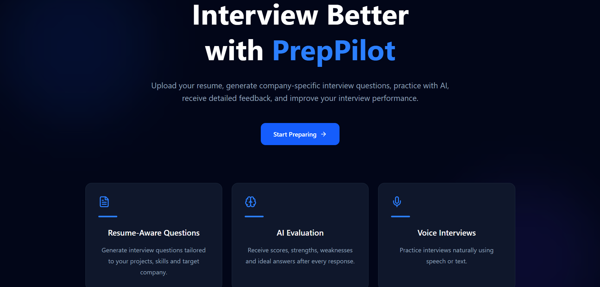
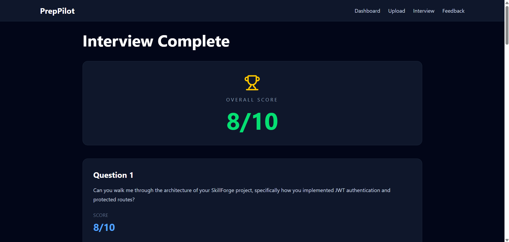

# PrepPilot

PrepPilot is an AI-powered mock interview platform that generates personalized interview questions from a candidate's resume and target job description, evaluates responses using an LLM, and provides detailed feedback to help improve interview performance.

## Live Demo

Frontend: https://prep-pilot-sooty.vercel.app/

Backend: https://preppilot-backend-uvpn.onrender.com

---

## Features

- Resume upload (PDF)
- Automatic PDF text extraction
- AI-generated interview questions tailored to the resume
- Company-specific interview preparation
- Voice-to-text answer input
- AI evaluation of every response
- Detailed feedback including:
  - Score
  - Strengths
  - Areas for improvement
  - Ideal answer
- Interview history
- Progress dashboard
- Responsive modern UI

---

## Tech Stack

### Frontend

- React
- TypeScript
- Tailwind CSS
- Vite
- Axios

### Backend

- Node.js
- Express.js
- Multer
- PDF.js
- Groq API (Llama 3.3 70B)

### Deployment

- Vercel
- Render

---

## System Workflow

Resume PDF
↓
PDF Parsing
↓
Groq LLM
↓
Personalized Interview Questions
↓
Candidate Answers (Text / Voice)
↓
AI Evaluation
↓
Feedback + Dashboard

---

## Project Structure

```
PrepPilot/
│
├── frontend/
│   ├── components/
│   ├── pages/
│   ├── services/
│   └── ...
│
├── backend/
│   ├── controllers/
│   ├── routes/
│   ├── services/
│   ├── middleware/
│   └── ...
```

---

## Installation

Clone the repository

```bash
git clone https://github.com/ashutosh-shahi/PrepPilot.git
```

Install frontend

```bash
cd frontend
npm install
npm run dev
```

Install backend

```bash
cd backend
npm install
npm start
```

---

## Environment Variables

Backend

```
GROQ_API_KEY=<your_groq_api_key>
```

Frontend

```
VITE_API_URL=http://localhost:5000/api
```

---

## Future Improvements

- User authentication
- MongoDB-based interview history
- Real-time interview timer
- Speech emotion analysis
- Better voice transcription
- Performance analytics
- Adaptive question difficulty

---

## Screenshots

### Landing Page



### Interview


### Feedback



### Dashboard


---

## Author

**Ashutosh Shahi**

Electrical Engineering, MANIT Bhopal

GitHub:
https://github.com/ashutosh-shahi
